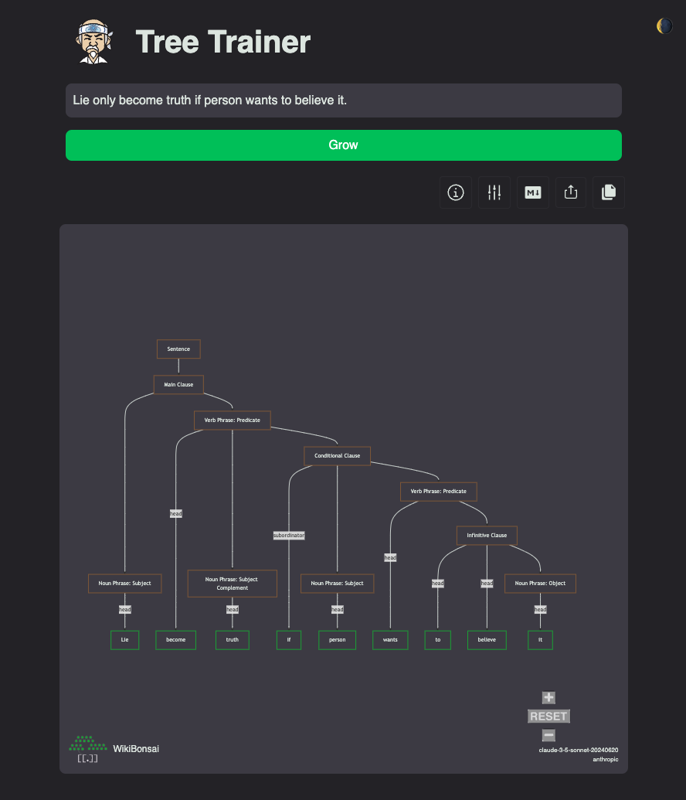

# the tree-trainer

[](https://github.com/wikibonsai/wikibonsai)

<p align="center">
  
</p>

> "Inside you have strong root. No need nothing except what inside you to grow."

```markdown
  🥢🧑
🍃  🥋
```

Train (syntax) trees for your [🎋 WikiBonsai](https://github.com/wikibonsai/wikibonsai) digital garden.

<p align="center">
  
</p>

### [Why Use This?](https://x.com/wibomd/status/1867336872865018340)

